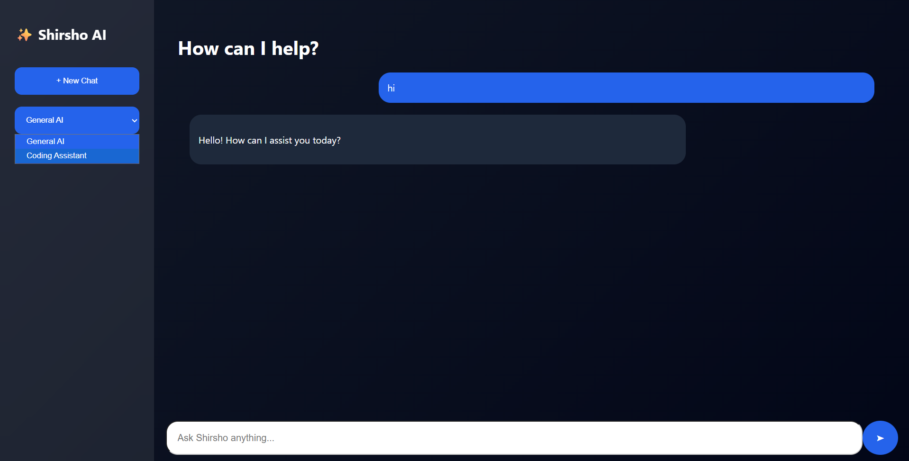
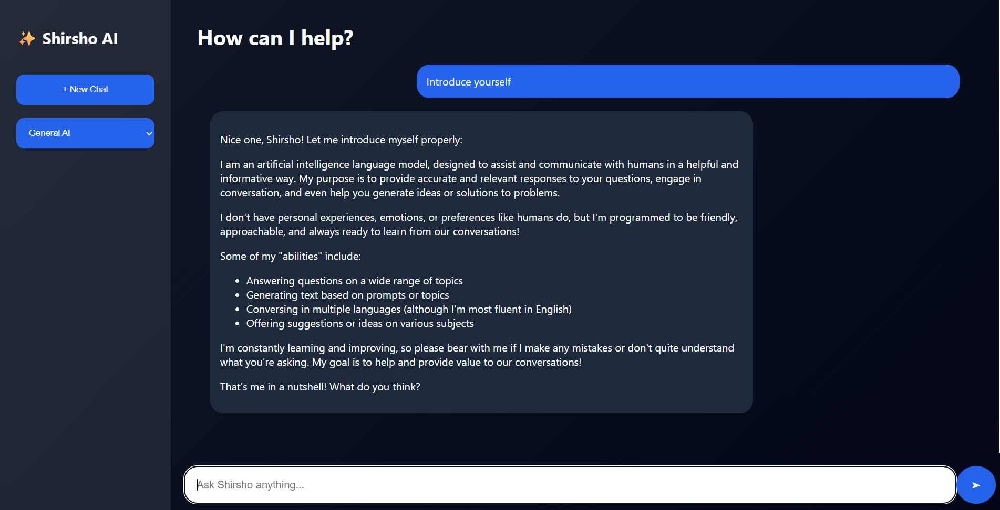

# 🤖 Shirsho AI - Local AI Chatbot

A ChatGPT-style AI assistant that I built using Python, Flask, and Ollama.

I made this project to understand how modern AI applications work — from sending user messages through a web interface to getting responses from a locally running Large Language Model (LLM). While building this project, I used documentation, tutorials, and AI tools (including ChatGPT) as learning resources to understand concepts, debug errors, and improve the implementation.

Instead of using paid APIs, this chatbot uses Ollama to run an open-source AI model locally on my computer.

---

## 🚀 Features

- ChatGPT-style interface
- Local AI responses using Ollama
- Conversation memory
- Coding assistant mode
- Modern dark-themed UI
- Markdown support for better formatted answers
- Runs completely locally without API costs

---

## 🛠️ Technologies Used

### Backend
- Python
- Flask

### AI
- Ollama
- Llama 3.2

### Frontend
- HTML
- CSS
- JavaScript

### Other
- SQLite (for storing chat data)

---

## 📂 Project Structure
AI-Assistant-Ollama

│
├── app.py # Flask backend
├── ai.py # AI response handling
├── database.py # Chat storage
│
├── templates/
│ └── index.html # Website interface
│
└── static/
├── style.css # UI design
└── script.js # Frontend logic

---

## ⚙️ How To Run

### 1. Install Ollama

Download Ollama and install it.

Pull the AI model:

ollama pull llama3.2

---

### 2. Install Python dependencies

pip install -r requirements.txt

---

### 3. Start Ollama

ollama serve
---

### 4. Run the chatbot

python app.py

Open:

http://127.0.0.1:5000/

---

## 📸 Screenshots

---

## 📚 What I Learned

While building this project, I learned:

- How local LLMs can be used without paid services
- How to structure a full-stack Python project
- Basics of AI application development

---

## 🔮 Future Improvements

Some features I want to add later:

- PDF question-answering using RAG
- Voice input/output
- Better chat history management
- Deploying it online

---

## 👨‍💻 Author

Shirshadeep Sarkar

IIEST Shibpur